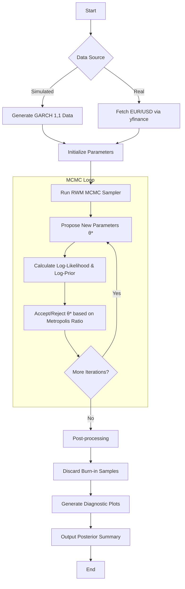

# Bayesian GARCH(1,1) MCMC Simulation

This project implements a **Bayesian GARCH(1,1) model** using a **Random Walk Metropolis (RWM)** sampler. It allows for estimating the parameters ($\omega$, $\alpha$, $\beta$) of a GARCH model from both simulated data and real-world financial returns (e.g., EUR/USD).

## Project Overview

The Generalized Autoregressive Conditional Heteroskedasticity (GARCH) model is a standard tool in financial econometrics for modeling time-varying volatility. This implementation uses Bayesian inference to estimate parameter posteriors, providing a robust way to quantify uncertainty.

### Key Features
- **Simulation**: Generate synthetic GARCH(1,1) processes with known parameters.
- **MCMC Sampler**: A custom Random Walk Metropolis-Hastings implementation.
- **Diagnostics**: Trace plots, posterior density histograms, and autocorrelation plots.
- **Real Data**: Integration with `yfinance` to fetch and analyze real financial time series.
- **Volatility Estimation**: Calculation of posterior mean conditional variance.

## Workflow Explanation

The following diagram illustrates the project's logic and execution flow:



## Mathematical Model

### GARCH(1,1) Model
$y_t = \sqrt{h_t} \epsilon_t, \quad \epsilon_t \sim N(0,1)$
$h_t = \omega + \alpha y_{t-1}^2 + \beta h_{t-1}$

### Constraints
- $\omega > 0$
- $\alpha \ge 0, \beta \ge 0$
- $\alpha + \beta < 1$ (Stationarity)

### Bayesian Setup
- **Likelihood**: Gaussian likelihood for the returns $y_t$.
- **Priors**: 
  - $p(\omega) \propto 1/\omega$ (Jeffreys-type prior)
  - $p(\alpha) \sim \text{Uniform}(0, 1)$
  - $p(\beta) \sim \text{Uniform}(0, 1)$
  - Subject to $\alpha + \beta < 1$.

## Installation

1. Clone the repository:
   ```bash
   git clone <repository-url>
   cd monte_carlo
   ```

2. Install dependencies:
   ```bash
   pip install -r requirements.txt
   ```

## Usage

You can run the main simulation and estimation script directly:

```bash
python garch_mcmc.py
```

Or explore the provided Jupyter notebooks in the `notebooks/` directory for step-by-step analysis:
- `notebooks/Q1.ipynb`: Initial exploration and simulation.
- `notebooks/Q2.ipynb`: Implementation of the sampler.
- `notebooks/Q3 and Q4.ipynb`: Advanced diagnostics and real data application.

## Results

The script generates several diagnostic plots saved in the `outputs/` directory:
- `outputs/garch_sim_diagnostics.png`: MCMC trace and posterior plots for simulated data.
- `outputs/garch_sim_volatility.png`: Simulated returns vs. estimated volatility.
- `outputs/garch_real_diagnostics.png`: Diagnostics for real financial data.
- `outputs/garch_persistence.png`: Posterior distribution of the persistence parameter ($\alpha + \beta$).

## References
- Mira, Solgi & Imparato (2013) "Zero variance Markov chain Monte Carlo for Bayesian estimators", *Statistics and Computing*.
- Ardia (2008) / Nakatsuma (2000) for GARCH prior setups.
